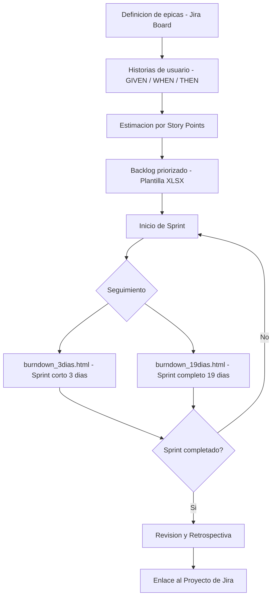

# Especificación de Requisitos — Proyecto Twitter Features

> Especificación completa de requisitos para un proyecto de nuevas funcionalidades en Twitter/X con historias de usuario, épicas en Jira y burn-down charts.

## Descripción

---

Especificación de requisitos de software aplicando metodología **SCRUM**: definición de épicas, historias de usuario con criterios de aceptación (formato GIVEN/WHEN/THEN), estimación por puntos de historia, backlog priorizado en **Jira** y gráficas de burn-down de 3 y 19 días para seguimiento del sprint.

## Contenido del repositorio

| Archivo | Descripción |
|---|---|
| `*.xlsx` | Plantilla con historias de usuario, épicas y puntos |
| `burndown_3dias.html` | Gráfica burn-down sprint corto (3 días) |
| `burndown_19dias.html` | Gráfica burn-down sprint completo (19 días) |
| `Enlace al Proyecto de Jira.*` | Enlace al tablero Jira del proyecto |

## Artefactos SCRUM generados

- **Épicas** definidas por dominio funcional (perfil, feed, seguridad, analytics)
- **Historias de usuario** con criterios de aceptación GIVEN/WHEN/THEN
- **Story points** estimados por complejidad relativa
- **Burn-down charts** interactivos para seguimiento de velocidad del equipo

## Contexto académico

**Asignatura:** Ingeniería de Software · **Institución:** Ingeniería Informática
**Autor:** Alejandro De Mendoza — Ingeniero Informático · Especialista Ingeniería de Software

---

## Arquitectura

## Autor

**Alejandro De Mendoza**  
Ingeniero Informático · Especialista en IA · Especialista en Ingeniería de Software · Máster en Arquitectura de Software

